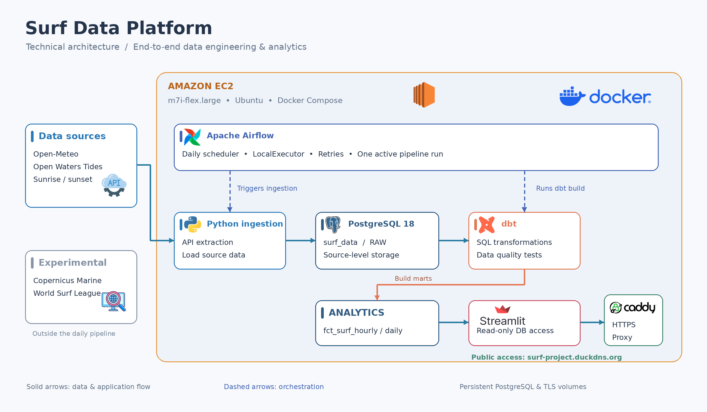

# End-to-End Data Engineering & Analytics Platform

> A production-oriented data platform that ingests, stores, transforms and analyzes multi-source marine and weather data, using **surf forecasting** as the use case.

**Stack:** Python · Apache Airflow · PostgreSQL · dbt · Docker Compose · AWS EC2 · Streamlit · Caddy · DuckDNS

### 🔗 [Live Demo — Streamlit Dashboard](https://surf-project.duckdns.org/)



## Overview

The platform was designed to collect data from several external APIs and datasets, model it into analytics-ready tables, and expose it through a deployed application.

It demonstrates:

- **End-to-end pipeline** — ingestion, storage, transformation, data quality checks and consumption
- **API integration** — five operational data feeds, with additional experimental WSL and Copernicus connectors
- **Orchestration** — a scheduled Airflow DAG with retries and overlap protection
- **Data modeling** — layered dbt models (staging → intermediate → marts) with automated tests
- **Cloud deployment** — Dockerized data platform and Streamlit dashboard on AWS EC2, with HTTPS through Caddy and a DuckDNS subdomain
- **Security** — least-privilege, read-only database access and externalized secrets
- **Analytics** — a transparent, parameter-driven, spot-specific Surf Index

The infrastructure was deliberately kept lightweight and designed around free-tier and free-to-use services to minimize operating costs.

## Architecture

```text
Data Sources
    ↓
Python Ingestion
    ↓
PostgreSQL RAW
    ↓
dbt Transformations
    ↓
PostgreSQL ANALYTICS
    ↓
Streamlit
```

| Layer | Technology | Responsibility |
|-------|------------|----------------|
| Orchestration | Apache Airflow | Schedules ingestion, then triggers `dbt build` |
| Ingestion | Python | Retrieves, validates, normalizes and loads source data |
| Storage | PostgreSQL 18 | `RAW` and `ANALYTICS` schemas (surf data) |
| Transformation | dbt | Staging, intermediate and mart models, plus tests |
| Application | Streamlit | User-facing analytics layer |
| Runtime | Docker Compose on AWS EC2 | Containerized platform (Airflow, PostgreSQL, dbt, Streamlit and Caddy) |
| Airflow metadata | PostgreSQL 16 | Separate database for Airflow state |
| Hosting | AWS EC2, Caddy and DuckDNS | Streamlit container with internal read-only database access, HTTPS reverse proxy and public subdomain |

Airflow orchestrates the pipeline but does not transform data: Python ingests, PostgreSQL stores, dbt transforms and Streamlit presents. This separation makes each layer easier to maintain, replace or extend.

## Data Sources & Ingestion

| Source | Data | Role |
|--------|------|------|
| Open-Meteo Weather API | Wind, temperature, atmospheric conditions | Weather conditions |
| Open-Meteo Marine API | Wave and swell height, period, direction | Wave and swell conditions |
| Open-Meteo Historical Forecast API | Archived weather forecasts | Forecast history and analysis |
| Open Waters Tides API | Tide levels, high/low tide predictions | Tidal conditions |
| Sunrise / sunset data | Local sunrise and sunset times | Surfable-hour filtering |
| Copernicus Marine Service | Global in-situ oceanographic observations | Experimental marine observation source |
| World Surf League (WSL) | Events, heats, competition results | Experimental surf event context source |

Open-Meteo provides the main weather and marine forecast layer. Open Waters exposes tide predictions through an open API based on the open-source Neaps harmonic prediction engine. Copernicus Marine and WSL connectors remain available in the repository for future analytical use, but they are kept outside the critical daily Airflow pipeline.

Each source is handled by a dedicated Python module:

```text
External Source → Python Connector → Validation & Normalization → PostgreSQL RAW
```

The `RAW` layer preserves source-level data before any transformation. Connectors can therefore be maintained or replaced without affecting downstream dbt models.

Historical forecast data is handled separately from the operational forecast pipeline, to support analysis of forecast evolution and potential future forecast-error studies.

## Orchestration with Apache Airflow

Airflow coordinates the ingestion jobs and ensures that the transformation runs only after source data has been collected. The pipeline is a single DAG, `surf_pipeline`, scheduled daily:

```text
Scheduled Run → Parallel Ingestion Tasks → dbt build → Analytics Dataset
```

Ingestion tasks cover weather, marine forecast, historical forecast, sunrise/sunset and tide data. Non-critical WSL and Copernicus sources are kept outside the daily DAG so temporary provider issues cannot block the production analytics refresh.

**Reliability settings**

| Setting | Purpose |
|---------|---------|
| `@daily` schedule | Daily refresh |
| 2 retries, 5-minute delay | Recover from temporary API or network failures |
| `catchup=False` | Avoid automatically processing historical scheduled runs |
| `max_active_runs=1` | Prevent overlapping executions |
| Date windows from the Airflow data interval | Reproducible ingestion runs |

Airflow runs with `LocalExecutor` inside a custom Docker image that bundles Airflow, the Python ingestion code, the dbt environment and project dependencies. Tasks therefore execute within that environment rather than on a separate worker cluster.

## Transformation & Data Modeling with dbt

dbt is the transformation, modeling and data quality layer. Python collects and loads the data; dbt manages SQL logic, dependencies, tests and analytical models.

```text
RAW → STAGING → INTERMEDIATE → MARTS
```

| Layer | Materialization | Responsibility |
|-------|-----------------|----------------|
| Staging | Views | Rename and standardize columns, cast types, normalize timestamps and units, light source-specific transformations |
| Intermediate | Views | Combine weather, marine and tide data; convert to local timezones; prepare daylight and surfable hours; compute intermediate indicators; join spot characteristics and scoring parameters |
| Marts | Tables | Final datasets consumed by Streamlit |

**Main fact tables**

- `fct_surf_hourly` — hourly surf conditions, forecasts and calculated surf scores
- `fct_surf_daily` — daily aggregated conditions and quality indicators

Marts are materialized as tables to give dashboard queries stable analytical datasets.

### Data Quality & Testing

Automated dbt tests cover primary-key uniqueness, non-null critical fields, referential integrity, accepted values and model-level consistency. The latest `dbt build` completed successfully with **213 dbt checks and models passing**, with no errors or warnings.

Because tests run as part of `dbt build`, data is validated before it reaches the dashboard.

### Why dbt?

- **Modular** — transformations are split into focused models
- **Testable** — data quality checks are automated
- **Traceable** — model dependencies form a clear transformation graph
- **Maintainable** — ingestion logic stays separate from analytical logic

## Surf Quality Scoring

The Surf Index is a transparent, parameter-driven score from 0 to 100. It is **not** a machine learning model: every score can be traced back to measurable swell, wind and tide conditions.

```text
Surf Index = 60% Swell + 25% Wind + 15% Tide
```

| Component | Weight | Breakdown |
|-----------|--------|-----------|
| Swell | 60% | 50% height, 25% period, 25% direction |
| Wind | 25% | 60% direction, 40% speed |
| Tide | 15% | Spot-specific tidal suitability (simplified in V1) |

Each component is normalized to a 0–100 score before being combined, and the result is converted into qualitative quality bands used by the dashboard.

**Spot-specific parameters.** A single set of global thresholds cannot represent different spots. Rather than hard-coding rules in SQL, parameter tables define, for each spot:

- preferred swell and wind directions
- wave-height ranges and preferred wave periods
- wind-speed thresholds
- tide preferences

This makes the scoring engine easier to calibrate. All calculations use local time and surfable daylight hours, so scores reflect the actual surfing window at each location.

### Design Process

The index was developed iteratively rather than defined upfront:

1. **Exploration** — analysis of the available variables (wave/swell height, period and direction, wind speed, direction and gusts, tide level and phase, sunrise/sunset, timezone, data availability) to identify those consistently available across spots.
2. **Unified conditions layer** — the `int_surf_conditions` model aligns timestamps, normalizes units and types, computes wind and swell directions, converts to local time and checks completeness. Environmental conditions are modeled first; scoring is applied afterwards.
3. **Simplification** — individual indicators (swell quality, wind quality, wave size, tide) were grouped into three components, since height, period and direction all describe the incoming swell. This balanced interpretability and complexity.
4. **Validation** — scores were inspected across spots and forecast periods to detect unexpected behavior, missing values and overly favorable or restrictive results, alongside duplicate detection, null audits, score-range checks and dbt tests. The first tide logic produced too little variation for some spots, so it was kept spot-specific and parameter-driven, with further calibration left to a future version.
5. **Forecast quality kept separate** — the Surf Index answers *how favorable are the predicted conditions?*. Forecast-error analysis using historical Open-Meteo forecasts would answer *how reliable is the forecast?*. Keeping them separate avoids mixing environmental conditions with forecast uncertainty.

## Streamlit Dashboard

Streamlit is the user-facing analytics layer. It reads `fct_surf_hourly` from the PostgreSQL `ANALYTICS` schema through a dedicated read-only user, and caches queries to reduce database load.

The dashboard allows users to:

- select a surf spot and local date
- view the daily Surf Index and overall quality
- identify the best surf window
- explore wave, swell and wind conditions
- visualize the hourly Surf Index and see how swell, wind and tide contribute to it

Only surfable daylight hours are shown as primary forecast results, using each spot's local timezone. The application is hosted in a Docker container on AWS EC2, served over HTTPS through Caddy at [surf-project.duckdns.org](https://surf-project.duckdns.org/), and covers several spots around the world.

## Deployment & Infrastructure

The platform runs on a single **AWS EC2** instance in `eu-west-3` (Paris), managed with **Docker Compose**:

- Apache Airflow — pipeline orchestration
- PostgreSQL 18 — surf data (`RAW` and `ANALYTICS`)
- PostgreSQL 16 — Airflow metadata
- dbt — transformation environment
- Streamlit — dashboard in a dedicated container
- Caddy — HTTPS reverse proxy

Persistent Docker volumes preserve PostgreSQL data across container restarts and deployments.

The Streamlit application runs alongside the backend in a separate Docker container and connects to the `ANALYTICS` layer through the internal Docker network using a restricted read-only connection.

Caddy acts as the public entry point, redirects HTTP to HTTPS and forwards browser traffic, including WebSocket connections, to Streamlit. It automatically obtains and renews TLS certificates, with certificate state preserved in Docker volumes. DuckDNS provides the free `surf-project.duckdns.org` subdomain pointing to the EC2 public IP address. Streamlit's application port is not exposed directly on the host.

This demonstrates a complete cloud deployment without unnecessary managed services or cost.

## Security

The security model is simple and based on least privilege:

- AWS Security Groups restrict access to the required ports
- Streamlit uses a dedicated PostgreSQL user with read-only access to the `ANALYTICS` schema only
- Database credentials are kept outside the Git repository; Streamlit credentials are stored in a protected server-side secrets file mounted read-only into its container
- AWS credentials and private keys are excluded from version control

## Engineering Decisions

The project was designed as a lightweight but complete data platform, prioritizing simplicity, transparency and cost efficiency.

| Decision | Rationale |
|----------|-----------|
| PostgreSQL for both `RAW` and `ANALYTICS` | Simple, low-cost storage with clear schema separation |
| Airflow for orchestration, dbt for transformation | Each tool does one job; ingestion and analytics logic stay decoupled |
| Single Dockerized EC2 instance | Reproducible deployment without managed-service cost |
| Streamlit in a separate container on EC2 | Independent application runtime with internal read-only database access |
| Caddy and DuckDNS for public access | Automatic HTTPS and a free public subdomain |
| Parameter-driven scoring instead of machine learning | Transparent, explainable and easy to calibrate |
| Free or open-source technologies | Minimize recurring infrastructure cost |

**Reliability and maintainability** come from Airflow retries, date-windowed ingestion for reproducible runs, overlap prevention, persistent volumes, a layered architecture, containerized execution and dbt tests run before data is exposed to the dashboard.

## Future Improvements

- Calibrate the Surf Index using historical observed surf conditions
- Integrate forecast-error analysis to estimate forecast reliability
- Expand the number of surf spots and data sources
- Improve tide modeling with more detailed spot-specific rules
- Introduce automated monitoring and alerting for pipeline failures
- Explore machine learning models once sufficient historical data is available

These are planned directions, not current features. The project is a foundation that can evolve from a portfolio data platform into a more advanced forecast analysis and decision-support system.
